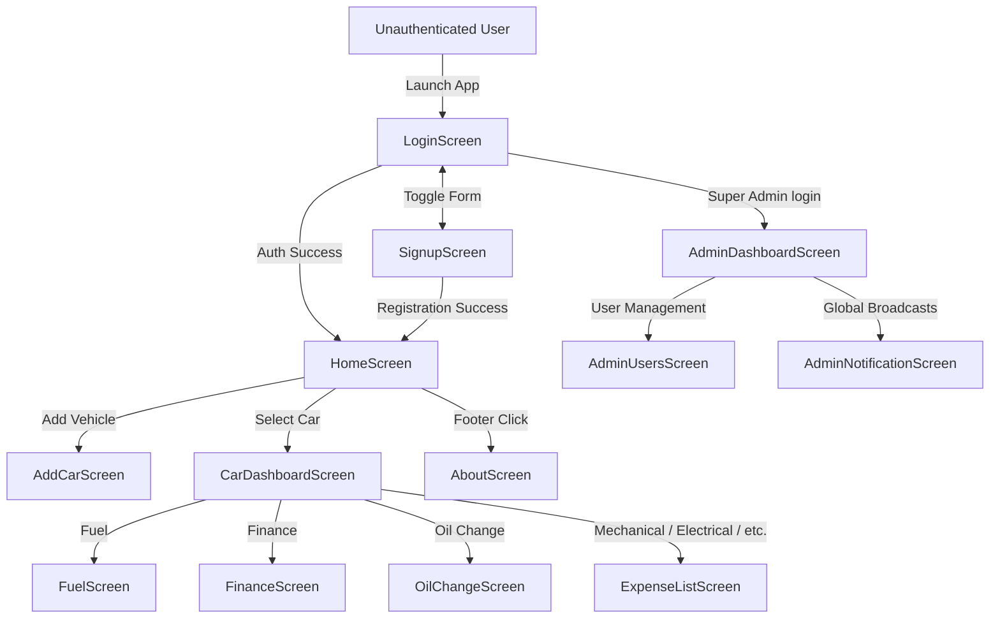
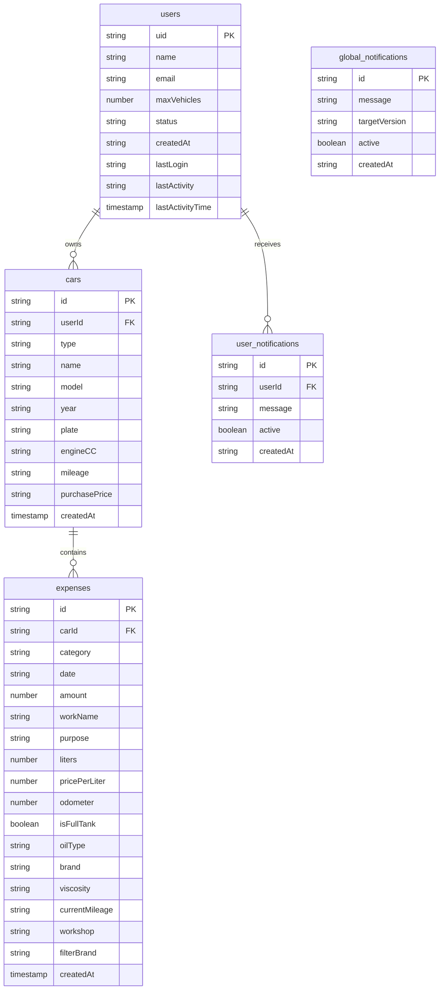

# 🚗 Mile Mint

**Mile Mint** is a cross-platform vehicle lifecycle management and expense tracking application. It gives individual vehicle owners, multi-vehicle households, and fleet managers a single place to log, analyze, and optimize every cost associated with owning and running a car or motorcycle — from daily fuel fills and routine oil changes to multi-year loan financing and unexpected repairs.

---

## 📋 Table of Contents

- [Overview](#-overview)
- [Tech Stack](#-tech-stack)
- [App Structure](#-app-structure)
- [Screens](#-screens)
- [Core Feature Logic](#-core-feature-logic)
  - [Fuel Screen](#fuel-screen)
  - [Finance Screen](#finance-screen)
  - [Oil / Maintenance Screen](#oil--maintenance-screen)
  - [Car Dashboard](#car-dashboard)
- [Admin Panel](#-admin-panel)
- [User Roles & Permissions](#-user-roles--permissions)
- [Data Model](#-data-model)
- [Monetization](#-monetization--tiering)

---

## 🔎 Overview

**Target Users**
- **Individual Vehicle & Bike Owners** — track fuel consumption, cost per km, and service history.
- **Multi-Vehicle Families & Fleet Managers** — a central dashboard for maintenance schedules and budgets across a whole garage.
- **App Administrators** — manage user accounts, monitor engagement, enforce vehicle limits, and broadcast alerts.

**Platform:** Cross-platform (iOS, Android, Web) via React Native + Expo.

---

## 🛠 Tech Stack

| Layer | Technology / Library | Purpose |
|---|---|---|
| Frontend Framework | React Native `0.81.5` + Expo SDK `54` | Cross-platform UI runtime |
| Language | TypeScript `5.3.3`, React `19.1.0` | Typed components & navigation logic |
| State Management | Zustand `4.5.4` | Global store: auth, active vehicle, currency, language, theme |
| Local Storage | `@react-native-async-storage/async-storage` | Persists user settings (dark mode, currency, language) |
| Navigation | `@react-navigation/native`, `@react-navigation/native-stack` | Native stack navigation |
| Backend & Database | Firebase SDK `10.12.2` | Firebase Auth + Cloud Firestore + Firebase Storage |
| UI / Charts | `react-native-gifted-charts`, `@expo/vector-icons`, `expo-linear-gradient` | Pie charts & visual elements |
| Localization | `i18next`, `react-i18next` | English, Urdu, Arabic, Chinese, Korean (with RTL support) |
| Date Handling | `@react-native-community/datetimepicker` | Native date picker with ISO parsing |

---

## 🧭 App Structure

The app has **13 screens** across four areas: Authentication, User Garage, Vehicle Management, and Admin Portal.



---

## 📱 Screens

| Screen | File | Purpose |
|---|---|---|
| `LoginScreen` | `LoginScreen.tsx` | Authentication, password reset, deactivated/deleted account handling |
| `SignupScreen` | `SignupScreen.tsx` | Registration, initializes user profile with default `maxVehicles: 5` |
| `HomeScreen` | `HomeScreen.tsx` | Garage view, quick stats, broadcast alerts, profile settings |
| `AddCarScreen` | `AddCarScreen.tsx` | Add/edit vehicle specs (type, name, model, year, plate, engine CC, mileage, valuation) |
| `CarDashboardScreen` | `CarDashboardScreen.tsx` | Vehicle control center: lifecycle cost, expense pie chart, AI insights, loan split, category grid |
| `FuelScreen` | `FuelScreen.tsx` | Fuel logging: liters, price/liter, odometer, full-tank flag, mileage & efficiency |
| `FinanceScreen` | `FinanceScreen.tsx` | Loan/EMI manager with guided setup wizard, progress tracking, overdue warnings |
| `OilChangeScreen` | `OilChangeScreen.tsx` | Engine/Gear/Brake oil change tracker with viscosity, brand, workshop, service intervals |
| `ExpenseListScreen` | `ExpenseListScreen.tsx` | Mechanical, Electrical, Body Work, Tax, and Other expense logs |
| `AboutScreen` | `AboutScreen.tsx` | Developer credits & build info |
| `AdminDashboardScreen` | `screens/admin/AdminDashboardScreen.tsx` | Total users, active/inactive donut chart, total vehicles, global expense metrics |
| `AdminUsersScreen` | `screens/admin/AdminUsersScreen.tsx` | User directory, search/filter, vehicle-limit adjuster, messaging, deactivate/delete |
| `AdminNotificationScreen` | `screens/admin/AdminNotificationScreen.tsx` | Compose & manage global broadcast notifications |

---

## ⚙️ Core Feature Logic

### Fuel Screen

**Displays:** total fuel spend, average mileage (km/l), total km logged, and full refuel history (date, liters, rate/liter, total price, odometer, full-tank status).

**Actions:** add / edit / delete a refuel log; choose Full Tank vs Partial refill.

**Calculations:**
```
Total Price      = Liters × Price per Liter
Δ km             = Odometer(current) − Odometer(previous full tank)
Mileage (km/l)   = Δ km ÷ Liters(current)
Efficiency (L/100km) = (Liters(current) ÷ Δ km) × 100
Cost per Km      = Amount(current) ÷ Δ km
Average Mileage  = (Odometer(latest) − Odometer(earliest)) ÷ Σ Liters
```

**Storage:** Firestore `expenses` collection, `category: 'Fuel'`.

---

### Finance Screen

**Displays:** remaining loan balance, repayment progress bar, next payment due date, loan completion date, monthly EMI, months tracked (X/Y), status badge, and payment history.

**Actions:**
- **Guided Setup Wizard:** Step 1 — New vs Existing Loan → Step 2 — total price, down payment, monthly EMI → Step 3 — loan tenure, start date, initial paid months (existing loans).
- Log a monthly installment or extra payment credit.
- Terminate/reset the finance plan (with confirmation).

**Calculations:**
```
Principal        = Total Price − Down Payment
Paid Amount      = (Initial Paid Months × Installment) + Σ Manual Payments
Remaining Balance = max(0, Principal − Paid Amount)
Progress %       = min(100, (Paid Amount ÷ Principal) × 100)
Next Payment Date = Start Date + Paid Months
Expected End Date = Start Date + Tenure Months
Is Overdue       = (Current Date > Next Payment Date) AND (Remaining Balance > 0)
```

**Storage:** setup config serialized as JSON in an `expenses` entry (`Finance_Setup`); subsequent payments stored under `category: 'Finance'`.

---

### Oil / Maintenance Screen

**Displays:** total oil spend, last service interval (km), current active oil card (viscosity, brand, mileage), and service history grouped by type (Engine, Gear, Brake).

**Actions:** log a change (category, brand, viscosity, mileage, workshop, filter brand, cost); edit/delete entries.

**Calculations:**
```
Interval = Mileage(current log) − Mileage(previous log, same type)
```

**Storage:** Firestore `expenses` collection, `category: 'OilChange'`.

---

### Car Dashboard

Aggregates all `expenses` documents for the selected vehicle:
```
Total Cost of Ownership = Σ Expenses + Σ Finance Paid
Category % = (Category Amount ÷ Total Cost) × 100
```
Also surfaces an AI-generated insight highlighting the highest expense category, a paid-vs-remaining loan split, and 8 category navigation tiles.

---

## 🔐 Admin Panel

Access is restricted to a single super-admin account, gated by email check in `App.tsx`:

```tsx
{user?.email?.toLowerCase() === 'chaudhrysamie@gmail.com' && (
  <>
    <Stack.Screen name="AdminDashboard" component={AdminDashboardScreen} />
    <Stack.Screen name="AdminUsers" component={AdminUsersScreen} />
    <Stack.Screen name="AdminNotifications" component={AdminNotificationScreen} />
  </>
)}
```

**Admin can:**
- View system analytics: total users, active/inactive/deleted accounts, total vehicles, total app expense volume.
- View an active-vs-inactive-vs-deleted donut chart.
- Search/filter users by name/email, status, and sort by recency/activity.
- Adjust a user's `maxVehicles` limit individually (e.g., 10 / 20 / 50).
- Send direct notifications to individual users.
- Deactivate/reactivate accounts (real-time listener force-signs-out deactivated users).
- Permanently delete accounts via a 2-step cascade delete (wipes vehicles, expenses, finance records, notifications; leaves a tombstone so the email can't re-register).
- Compose and publish/unpublish global broadcast notifications, optionally targeted by app version.

> ⚠️ **Note:** Super-admin access is currently gated by a hardcoded email string rather than a role field or custom claim — worth revisiting for production security hardening.

---

## 👥 User Roles & Permissions

| Action / Feature | Normal User | Super Admin |
|---|:---:|:---:|
| View own garage & vehicles | ✅ | ✅ |
| Log/edit fuel, oil, finance, expenses | ✅ | ✅ |
| Switch language, currency, dark mode | ✅ | ✅ |
| Exceed default vehicle limit (5) | ❌ (needs admin upgrade) | ✅ |
| Access Admin Portal & metrics | ❌ | ✅ |
| Adjust vehicle limits for users | ❌ | ✅ |
| Deactivate/delete accounts | ❌ | ✅ |
| Send global broadcasts | ❌ | ✅ |

**Limit enforcement** (`AddCarScreen.tsx`):

```ts
if (!isEdit) {
  let vehicleLimit = 5;
  try {
    const userDoc = await db.collection('users').doc(user.uid).get();
    vehicleLimit = userDoc.data()?.maxVehicles || 5;
  } catch (_) {}
  if (cars.length >= vehicleLimit) {
    setStatusModal({
      visible: true,
      type: 'error',
      title: 'Limit Reached',
      message: `You have reached your limit of ${vehicleLimit} vehicles. Contact admin to increase limit.`,
    });
    return;
  }
}
```

---

## 🗄 Data Model

Cloud Firestore, 5 primary collections:



---

## 💰 Monetization & Tiering

**Free Tier**
- Default limit: **5 vehicles/bikes**.
- Full access to fuel logging, oil maintenance tracking, finance/loan manager, expense logs, and multi-currency support.

**Pro / Fleet Owner Tier**
- Admin can raise a user's `maxVehicles` (10 / 20 / 50 / 100) via the Admin User Management screen.
- Architecture is designed to integrate with in-app purchases or Stripe to monetize fleet operators needing higher/unlimited vehicle quotas.

---

## 📄 License

Add your license here.

## 👨‍💻 Author

**Chaudhry Samie** — Lead Developer
