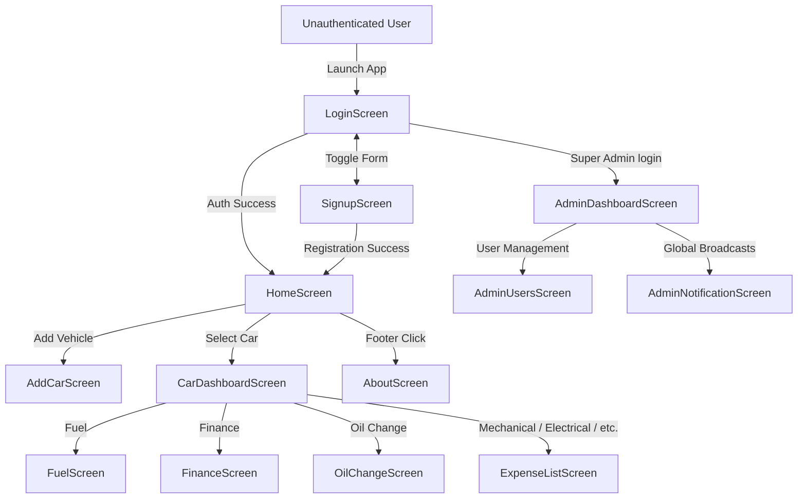
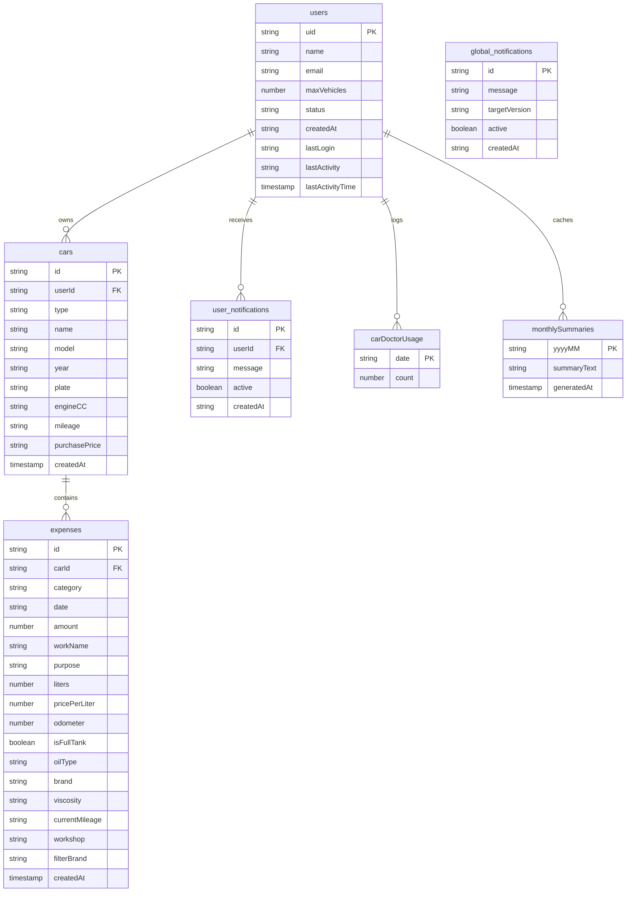

<div align="center">

# 🚗 Mile Mint

**A free, forever vehicle lifecycle & expense tracker — built to run at zero server cost.**

Mile Mint gives individual vehicle owners, multi-vehicle households, and fleet managers a single place to log, analyze, and optimize every cost of owning and running a car or motorcycle — from daily fuel fills and routine oil changes to multi-year loan financing and unexpected repairs. It ships with an AI troubleshooting assistant and AI-written monthly spending summaries, all running on free-tier infrastructure.

[](https://reactnative.dev/)
[](https://expo.dev/)
[](https://www.typescriptlang.org/)
[-FFCA28?logo=firebase&logoColor=black)](https://firebase.google.com/)
[](#-license)

</div>

---

## 📋 Table of Contents

- [Overview](#-overview)
- [Features](#-features)
- [Tech Stack](#-tech-stack)
- [App Structure](#-app-structure)
- [Screens](#-screens)
- [Core Feature Logic](#-core-feature-logic)
- [AI Integration](#-ai-integration)
- [Admin Panel](#-admin-panel)
- [User Roles & Permissions](#-user-roles--permissions)
- [Data Model](#-data-model)
- [Cost & Efficiency Strategy](#-cost--efficiency-strategy)
- [Known Limitations](#-known-limitations)
- [Getting Started](#-getting-started)
- [Developer](#-developer)
- [License](#-license)

---

## 🔎 Overview

**Target Users**
- **Individual vehicle & bike owners** — track fuel consumption, cost per km, and service history.
- **Multi-vehicle households** — a central dashboard for maintenance schedules and budgets across a whole garage.
- **App administrators** — manage user accounts, monitor engagement, enforce vehicle limits, and broadcast alerts.

**Platform:** React Native + Expo (Android-first, cross-platform capable).

**Core constraint:** Every architectural decision in this app was made to satisfy one hard rule — it must run **forever, at zero cost, for 50–100+ users** — using only Firebase's free Spark plan and Gemini's free API tier, with no billing account required.

---

## ✨ Features

| Category | Feature | Description |
|---|---|---|
| 📊 **Tracking** | Fuel Logging | Log fill-ups, auto-calculate mileage/efficiency (handles partial and full-tank fill-ups) |
| | Expense Logging | Mechanical, Electrical, Body Work, Tax, and Other expense categories |
| | Oil / Maintenance Logging | Engine, Gear, and Brake oil tracking with viscosity, brand, workshop, service intervals |
| | Finance / EMI Tracking | Guided loan setup wizard, progress tracking, overdue detection |
| 🔔 **Reminders** | Finance Due-Date Notifications | Local push reminders before EMI payments are due |
| | Global & Direct Notifications | Admin-broadcast announcements and per-user messages via FCM |
| 🤖 **AI (Gemini Flash)** | Car Doctor | Describe a car problem, get AI-suggested possible causes — single-turn, no chat history stored |
| | Monthly AI Summary | AI-written summary of the month's spending, cached to run once per vehicle per month |
| | Dashboard AI Insight | Highlights the vehicle's highest expense category |
| 📈 **Insights** | Expense Breakdown | Pie chart of spending by category |
| | Total Cost of Ownership | Aggregates expenses + finance payments across a vehicle's lifetime |
| | PDF Export | Full vehicle history exported as a shareable, branded PDF — stored locally on-device only |
| 🎨 **UX** | Dark / Light Theme | Full theme toggle, persisted across sessions |
| | Multi-language | English, Urdu, Arabic, Chinese, Korean — with RTL support |
| | Multi-currency | Switch displayed currency app-wide |
| | Onboarding Flow | First-launch walkthrough for new users |
| ℹ️ **Meta** | About Screen | Developer info, links, app version, update status |
| | Version Check | Compares local app version against a Firestore-managed "latest version" flag |
| 🛡 **Admin** | Analytics Dashboard | Total/active/inactive users, total vehicles, total expense volume |
| | User Management | Search/filter, adjust vehicle limits, deactivate/delete accounts |
| | Broadcasts | Global and direct user notifications |

---

## 🛠 Tech Stack

| Layer | Technology / Library | Purpose |
|---|---|---|
| Frontend Framework | React Native `0.81.5` + Expo SDK `54` | Cross-platform UI runtime |
| Language | TypeScript `5.3.3`, React `19.1.0` | Typed components & navigation logic |
| State Management | Zustand `4.5.4` | Global store: auth, active vehicle, currency, language, theme |
| Local Storage | `@react-native-async-storage/async-storage` | Persists user settings (dark mode, currency, language) |
| Navigation | `@react-navigation/native`, `@react-navigation/native-stack` | Native stack navigation |
| Backend & Database | Firebase SDK `10.12.2` | Firebase Auth + Cloud Firestore (Spark/free tier) |
| AI | Google Gemini (`gemini-2.5-flash`) | Car Doctor troubleshooting + Monthly AI Summary |
| Notifications | `expo-notifications` + Firebase Cloud Messaging | Local reminders + global/direct admin broadcasts |
| PDF Generation | `expo-print`, `expo-file-system`, `expo-sharing` | On-device report export, no server upload |
| UI / Charts | `react-native-gifted-charts`, `@expo/vector-icons`, `expo-linear-gradient` | Pie charts & visual elements |
| Localization | `i18next`, `react-i18next` | English, Urdu, Arabic, Chinese, Korean (with RTL support) |
| Date Handling | `@react-native-community/datetimepicker` | Native date picker with ISO parsing |

> **Deliberately not used:** Firebase Cloud Functions and Firebase Storage. Both now require a linked billing account even on the free Spark plan — avoiding them keeps this project genuinely free with no card on file.

---

## 🧭 App Structure

13 screens across four areas: Authentication, User Garage, Vehicle Management, and Admin Portal.



---

## 📱 Screens

| Screen | File | Purpose |
|---|---|---|
| `LoginScreen` | `LoginScreen.tsx` | Authentication, password reset, deactivated/deleted account handling |
| `SignupScreen` | `SignupScreen.tsx` | Registration, initializes user profile with default `maxVehicles: 5` |
| `HomeScreen` | `HomeScreen.tsx` | Garage view, quick stats, broadcast alerts, profile settings |
| `AddCarScreen` | `AddCarScreen.tsx` | Add/edit vehicle specs (type, name, model, year, plate, engine CC, mileage, valuation) |
| `CarDashboardScreen` | `CarDashboardScreen.tsx` | Vehicle control center: lifecycle cost, expense pie chart, AI insights, loan split, category grid |
| `FuelScreen` | `FuelScreen.tsx` | Fuel logging: liters, price/liter, odometer, full-tank flag, mileage & efficiency |
| `FinanceScreen` | `FinanceScreen.tsx` | Loan/EMI manager with guided setup wizard, progress tracking, overdue warnings |
| `OilChangeScreen` | `OilChangeScreen.tsx` | Engine/Gear/Brake oil change tracker with viscosity, brand, workshop, service intervals |
| `ExpenseListScreen` | `ExpenseListScreen.tsx` | Mechanical, Electrical, Body Work, Tax, and Other expense logs |
| `AboutScreen` | `AboutScreen.tsx` | Developer credits, links, version status, feedback |
| `AdminDashboardScreen` | `screens/admin/AdminDashboardScreen.tsx` | Total users, active/inactive donut chart, total vehicles, global expense metrics |
| `AdminUsersScreen` | `screens/admin/AdminUsersScreen.tsx` | User directory, search/filter, vehicle-limit adjuster, messaging, deactivate/delete |
| `AdminNotificationScreen` | `screens/admin/AdminNotificationScreen.tsx` | Compose & manage global broadcast notifications |

---

## ⚙️ Core Feature Logic

### Fuel Screen

**Displays:** total fuel spend, average mileage (km/l), total km logged, and full refuel history (date, liters, rate/liter, total price, odometer, full-tank status).

**Actions:** add / edit / delete a refuel log; choose Full Tank vs Partial refill.

**Calculations:**
```
Total Price           = Liters × Price per Liter
Δ km                  = Odometer(current) − Odometer(previous full tank)
Mileage (km/l)        = Δ km ÷ Liters(current)
Efficiency (L/100km)  = (Liters(current) ÷ Δ km) × 100
Cost per Km           = Amount(current) ÷ Δ km
Average Mileage       = (Odometer(latest) − Odometer(earliest)) ÷ Σ Liters
```

**Storage:** Firestore `expenses` collection, `category: 'Fuel'`.

---

### Finance Screen

**Displays:** remaining loan balance, repayment progress bar, next payment due date, loan completion date, monthly EMI, months tracked (X/Y), status badge, and payment history.

**Actions:**
- **Guided Setup Wizard:** Step 1 — New vs Existing Loan → Step 2 — total price, down payment, monthly EMI → Step 3 — loan tenure, start date, initial paid months (existing loans).
- Log a monthly installment or extra payment credit.
- Terminate/reset the finance plan (with confirmation).

**Calculations:**
```
Principal          = Total Price − Down Payment
Paid Amount        = (Initial Paid Months × Installment) + Σ Manual Payments
Remaining Balance  = max(0, Principal − Paid Amount)
Progress %         = min(100, (Paid Amount ÷ Principal) × 100)
Next Payment Date  = Start Date + Paid Months
Expected End Date  = Start Date + Tenure Months
Is Overdue         = (Current Date > Next Payment Date) AND (Remaining Balance > 0)
```

**Storage:** setup config serialized as JSON in an `expenses` entry (`Finance_Setup`); subsequent payments stored under `category: 'Finance'`.

---

### Oil / Maintenance Screen

**Displays:** total oil spend, last service interval (km), current active oil card (viscosity, brand, mileage), and service history grouped by type (Engine, Gear, Brake).

**Actions:** log a change (category, brand, viscosity, mileage, workshop, filter brand, cost); edit/delete entries.

**Calculations:**
```
Interval = Mileage(current log) − Mileage(previous log, same type)
```

**Storage:** Firestore `expenses` collection, `category: 'OilChange'`.

---

### Car Dashboard

Aggregates all `expenses` documents for the selected vehicle:
```
Total Cost of Ownership = Σ Expenses + Σ Finance Paid
Category %               = (Category Amount ÷ Total Cost) × 100
```
Also surfaces an AI-generated insight highlighting the highest expense category, a paid-vs-remaining loan split, the Monthly AI Summary card, and category navigation tiles.

---

## 🤖 AI Integration

Both AI features run on **Gemini `gemini-2.5-flash`**, called directly from the client — no server or Cloud Function in between.

### Car Doctor
- **Trigger:** User describes a car problem in free text via the floating "Car Doctor" button.
- **Input sent to AI:** Only the raw problem description — no personal or vehicle data.
- **Output:** 2–3 brief possible causes, plain language, under 80 words, always ending with a mechanic-consultation disclaimer.
- **Rate limit:** **5 requests/user/day**, enforced via a Firestore counter at `users/{uid}/carDoctorUsage/{yyyy-mm-dd}`.
- **History:** None. Fully single-turn — nothing is persisted after the modal closes.

### Monthly AI Summary
- **Trigger:** Viewing the Car Dashboard.
- **Input sent to AI:** A small aggregated object — `vehicleName`, `month`, `totalSpent`, `previousMonthSpent`, `fuelSpent`, `avgMileage`, `overduePayments`, `oilChangeStatus`. Full transaction history is never sent.
- **Output:** A warm, 3-sentence summary in the user's selected language, under 60 words.
- **Caching:** Generated **once per vehicle per month**, cached at `monthlySummaries/{yyyy-mm}`. Subsequent visits read the cache — zero additional API calls until the month rolls over.
- **Fallback:** If the API call fails, a deterministic local sentence is generated from the same data instead of showing an error.

### Free Tier Cost Math
| Feature | Max calls per user/day | At 100 users |
|---|---|---|
| Car Doctor | 5 | ~500/day |
| Monthly Summary | ~0.03 (1/month) | ~3–4/day |
| **Total** | — | **~500–510/day** |

This comfortably fits inside Gemini Flash's free daily quota, with no billing account required.

---

## 🔐 Admin Panel

Access is restricted to a single super-admin account, gated by an email check in `App.tsx`:

```tsx
{user?.email?.toLowerCase() === 'chaudhrysamie@gmail.com' && (
  <>
    <Stack.Screen name="AdminDashboard" component={AdminDashboardScreen} />
    <Stack.Screen name="AdminUsers" component={AdminUsersScreen} />
    <Stack.Screen name="AdminNotifications" component={AdminNotificationScreen} />
  </>
)}
```

**Admin can:**
- View system analytics: total users, active/inactive/deleted accounts, total vehicles, total app expense volume.
- View an active-vs-inactive-vs-deleted donut chart.
- Search/filter users by name/email, status, and sort by recency/activity.
- Adjust a user's `maxVehicles` limit individually (e.g., 10 / 20 / 50).
- Send direct notifications to individual users.
- Deactivate/reactivate accounts (real-time listener force-signs-out deactivated users).
- Permanently delete accounts via a 2-step cascade delete (wipes vehicles, expenses, finance records, notifications; leaves a tombstone so the email can't re-register).
- Compose and publish/unpublish global broadcast notifications, optionally targeted by app version.
- Update the `appConfig/versionInfo` document to flag new releases as available.

> ⚠️ **Note:** Super-admin access is currently gated by a hardcoded email string rather than a role field or Firebase Custom Claim — a reasonable simplification for a single-admin project, but worth revisiting for multi-admin production use.

**Global announcements** are composed and published through `AdminNotificationScreen` via Firebase Cloud Messaging topics (`announcements`) — no separate server is involved in sending them.

---

## 👥 User Roles & Permissions

| Action / Feature | Normal User | Super Admin |
|---|:---:|:---:|
| View own garage & vehicles | ✅ | ✅ |
| Log/edit fuel, oil, finance, expenses | ✅ | ✅ |
| Use Car Doctor & Monthly AI Summary | ✅ | ✅ |
| Switch language, currency, dark mode | ✅ | ✅ |
| Exceed default vehicle limit (5) | ❌ (needs admin upgrade) | ✅ |
| Access Admin Portal & metrics | ❌ | ✅ |
| Adjust vehicle limits for users | ❌ | ✅ |
| Deactivate/delete accounts | ❌ | ✅ |
| Send global broadcasts | ❌ | ✅ |

**Limit enforcement** (`AddCarScreen.tsx`):

```ts
if (!isEdit) {
  let vehicleLimit = 5;
  try {
    const userDoc = await db.collection('users').doc(user.uid).get();
    vehicleLimit = userDoc.data()?.maxVehicles || 5;
  } catch (_) {}
  if (cars.length >= vehicleLimit) {
    setStatusModal({
      visible: true,
      type: 'error',
      title: 'Limit Reached',
      message: `You have reached your limit of ${vehicleLimit} vehicles. Contact admin to increase limit.`,
    });
    return;
  }
}
```

---

## 🗄 Data Model

Cloud Firestore, kept intentionally **flat** — no server-side joins. The client queries by `userId`/`carId` and aggregates locally.



**Text reference:**
```
users/{uid}
  ├─ uid, name, email, maxVehicles, status, createdAt, lastLogin, lastActivity
  ├─ carDoctorUsage/{yyyy-mm-dd}      → { count }
  ├─ user_notifications/{id}          → { message, active, createdAt }
  └─ vehicles/{vehicleId}
        └─ monthlySummaries/{yyyy-mm} → { summaryText, generatedAt }

cars/{carId}
  └─ id, userId, type, name, model, year, plate, engineCC, mileage, purchasePrice, createdAt

expenses/{expenseId}
  └─ id, carId, category, date, amount, workName, purpose,
     liters?, pricePerLiter?, odometer?, isFullTank?,
     oilType?, brand?, viscosity?, workshop?, filterBrand?, createdAt

global_notifications/{id}
  └─ message, targetVersion, active, createdAt

appConfig/versionInfo
  └─ latestVersion, updateMessage, downloadUrl
```

> No `firestore.rules` file currently exists in the repo — access rules are managed directly via the Firebase Console.

---

## 💸 Cost & Efficiency Strategy

Mile Mint is built to run indefinitely on **Firebase's Spark (free) plan** and **Gemini's free API tier**, with no billing account required:

1. **No Cloud Functions** — all logic, including AI calls, runs client-side.
2. **No Cloud Storage** — avoids the billing requirement now attached to Firebase Storage.
3. **Client-side rate limiting** — every AI feature enforces its own cap via Firestore counters/caching, so usage can never silently balloon past the free tier.
4. **Flat data model** — no server-side aggregation needed; the client fetches by `carId` and computes charts/reports locally.
5. **Local-only exports** — PDF reports are generated and shared entirely on-device (`expo-print` + `expo-sharing`), never uploaded anywhere.

---

## 📌 Known Limitations

- **No offline support** — most features require an active internet connection.
- **Monthly AI Summary staleness** — cached once per month by design; won't reflect new activity until the next calendar month (or a manual regeneration, if enabled).
- **Root-level collections** — `expenses` and `cars` live at the Firestore root rather than nested under `users`, relying on `userId`/`carId` fields for scoping.
- **Admin check is client-side** — a hardcoded email comparison, not Firebase Custom Claims. Sufficient for a single-admin portfolio project, but would need hardening for multi-admin production use.

---

## 🚀 Getting Started

### Prerequisites
- Node.js (LTS)
- Expo CLI
- A Firebase project (Spark/free plan)
- A Gemini API key ([Google AI Studio](https://aistudio.google.com/apikey))

### Setup

```bash
git clone https://github.com/ChaudhrySamie/mile-mint.git
cd mile-mint
npm install
```

Create a `.env` file in the project root:

```env
EXPO_PUBLIC_GEMINI_API_KEY=your_gemini_api_key_here
```

Add your Firebase config to `services/firebaseConfig.ts`.

Run the app:

```bash
npx expo start
```

> ⚠️ **Note:** Remote push notifications (admin broadcasts) require a development build — they are not supported in Expo Go (SDK 53+). Local notifications (finance reminders) work fine in Expo Go.

---

## 👤 Developer

**Chaudhry Samie Tahir** — Full Stack Developer

- 🌐 Portfolio: [chaudhrysamie.netlify.app](https://chaudhrysamie.netlify.app/)
- 💼 LinkedIn: [chaudhry-samie-tahir](https://www.linkedin.com/in/chaudhry-samie-tahir-106b0a269/)
- ✉️ Email: chaudhrysamie@gmail.com

---

## 📄 License

This project is licensed under the MIT License.

---

<div align="center">
Built By Chaudhry Samie.
</div>
